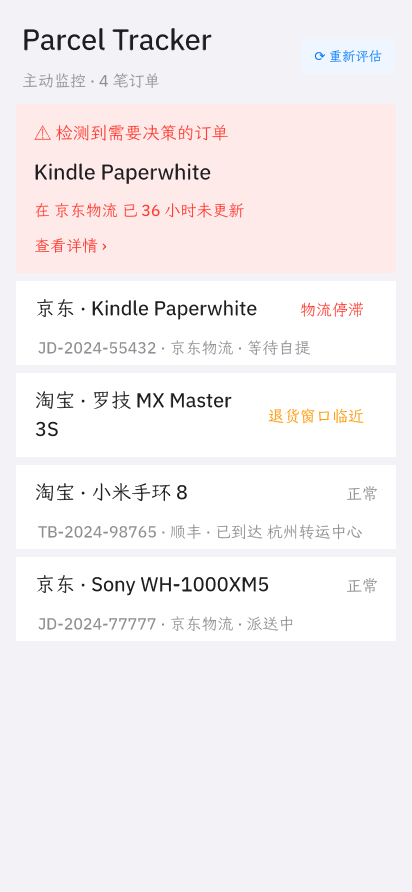
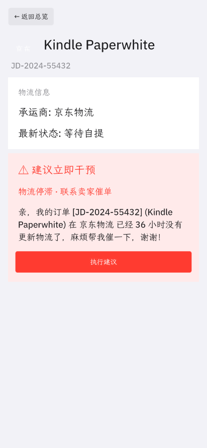
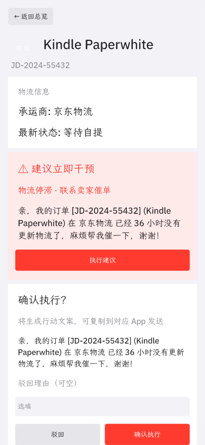
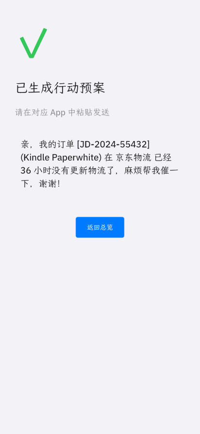
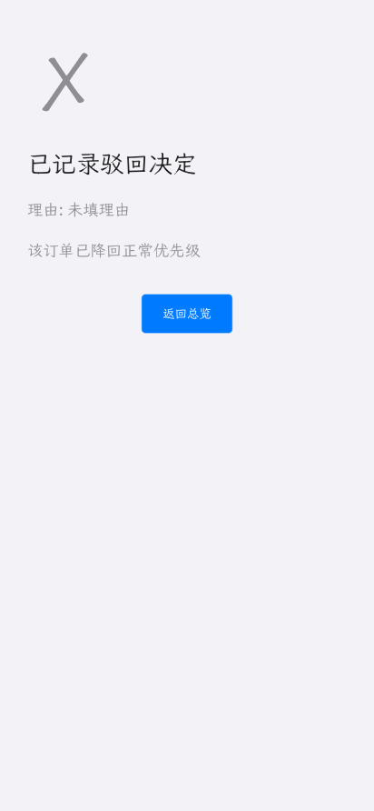

# Parcel Tracker

> 主动出击的 Agentic 包裹管家——不是被动的物流查询器。

[](LICENSE)
[](#)

## 简介

包裹追踪类 App 多到数不清，**它们都做错了一件事**——把"展示订单列表"当成了产品价值。但真正花你时间的从来不是"看"，是"接下来怎么办"：是去催那个停滞 3 天的卖家，还是去申请那个今晚 23:59 就关掉的退货窗口？

Parcel Tracker 不替你下单、不替你付款、不替你发消息——它只做一件事：**替你判断哪一笔订单最值得你花 30 秒**，把现成的话术写好，等你拍板（确认执行 / 驳回）。

Agentic App 黑客松初赛作品，购物与物流赛道。4 笔 Mock 订单 + 确定性评分规则，无外部 API、无 LLM 调用。

## 功能特性

- **主动扫描** — 启动时和 `⟳ 重新评估` 时重跑评分，按 `time_now() - boot_time` 算出真实时间漂移
- **三种异常识别** — 物流停滞（24h 无更新）/ 退货窗口临近（已签收且剩余 < 48h）/ 已逾期（过 ETA 未签收）
- **可执行的话术生成** — 给卖家催单 / 申请退货退款两类文案，写好待复制粘贴
- **授权确认流** — 详情页点"执行建议"→ 二次确认卡 → 确认才落盘，未经授权不落地
- **驳回也是合法结果** — 灰色✗路径，理由可选，订单回到正常优先级；不是边缘情况
- **跨重启记忆** — `session.json` + `decisions.json` 持久化，避免对同一笔订单反复决策
- **零外部依赖** — `network.hosts = []`，`capabilities = ["storage"]`

## 技术栈

- **OctoScript (L0)** — 脚本应用语言，`bundle/main.splash` 430 行
- **OctoSense card-host** — 在能力沙箱里执行 bundle
- **Hub** — 准入与完整性校验
- **glibc / X11 / Wayland** — card-host 的图形后端
- **fcitx5** — WSLg 中文输入法（可选）

## 环境要求

- **OctoScript-App-Design-Flow** — 仓库内的 `tools/octo`、`OctoSense-App-Hub/target/release/{card-host,hub}`
- **WSLg 或 X11 转发** — card-host 需要图形上下文（headless 用 xvfb-run + 软件 GL）
- **可选 fcitx5** — `apt install fcitx5 fcitx5-chinese-addons` 才能在 TextInput 打中文
- **WSL2 Linux 发行版** — 已验证 Ubuntu 24.04 / glibc 兼容
- **Git + SSH key** — 已配好 GitHub 推送权限

## 安装

```bash
# 1. 拉取代码
git clone https://github.com/DitingZhang/OctoParcel.git
cd OctoParcel

# 2. 校验 + 重新盖章（hub 完整性 + L0 语法）
~/agentic-new/OctoScript-App-Design-Flow/tools/octo check bundle

# 3. 启动带远程控制的 card-host
~/agentic-new/OctoScript-App-Design-Flow/tools/octo run bundle --port 8142 --detach

# 4. 验证它在跑
curl -s 127.0.0.1:8142/snap | python3 -m json.tool | head -20

# 5. 跑一遍流程并截图
~/agentic-new/OctoScript-App-Design-Flow/tools/octo shot 8142 out.png
```

需要 `--allow-unsigned`（这次没接发布者密钥）；中文输入需要 `GTK_IM_MODULE=fcitx QT_IM_MODULE=fcitx XMODIFIERS=@im=fcitx` 三个环境变量下启动 card-host。详见 `bundle/main.splash` 顶部的注释。

---

### 流程截图

| | |
|---|---|
| `01-overview.png` 总览<br>4 笔订单按紧急度降序，红色 Banner 锁定最高优先级 |  |
| `02-detail-stuck.png` 详情-停滞<br>Kindle 在 京东物流 36 小时没动，红色"建议立即干预"卡片给出催单话术 |  |
| `03-confirm-execute.png` 确认<br>话术再展示一遍，可填驳回理由，两颗按钮：驳回 / 确认执行 |  |
| `04-result-ok.png` 结果-成功<br>绿色 ✓，写好待复制粘贴的文案 |  |
| `05-result-fail.png` 结果-驳回<br>灰色 ✗，记录了驳回理由，该订单回到普通优先级 |  |

### 评分规则

| 条件 | 分数 | 标签 | 建议 |
|---|---|---|---|
| 已签收，且 7 天退货窗口**剩余不到 48 小时** | 60 | return_closing | 申请退货退款 |
| **24 小时以上没更新**物流 | 40 | stuck | 联系卖家催单 |
| 已过预计送达时间 + 未签收 | 40 | overdue | 联系卖家催单 |
| 已经过用户决策的订单 | 5 | — | 不再进 Banner |
| 其他 | 10 | normal | 灰色标签，无 Banner |

### 已知坑

| 现象 | 解法 |
|---|---|
| TextInput 打不出中文（WSLg） | `apt install fcitx5 fcitx5-chinese-addons` + 三个 IM env |
| `/g` 返回 "grab timeout" | `LIBGL_ALWAYS_SOFTWARE=1 GALLIUM_DRIVER=softpipe xvfb-run`，或 `MAKEPAD_WRITE_FRAMEBUFFER_PNG` 直接落盘 |
| `octo check` 报 unsigned | 本地加 `--allow-unsigned`；上架要 publisher key |
| curl 127.0.0.1 不通 | shell `http_proxy` 劫持了，加 `--noproxy '*'` |

---

Apache-2.0。
